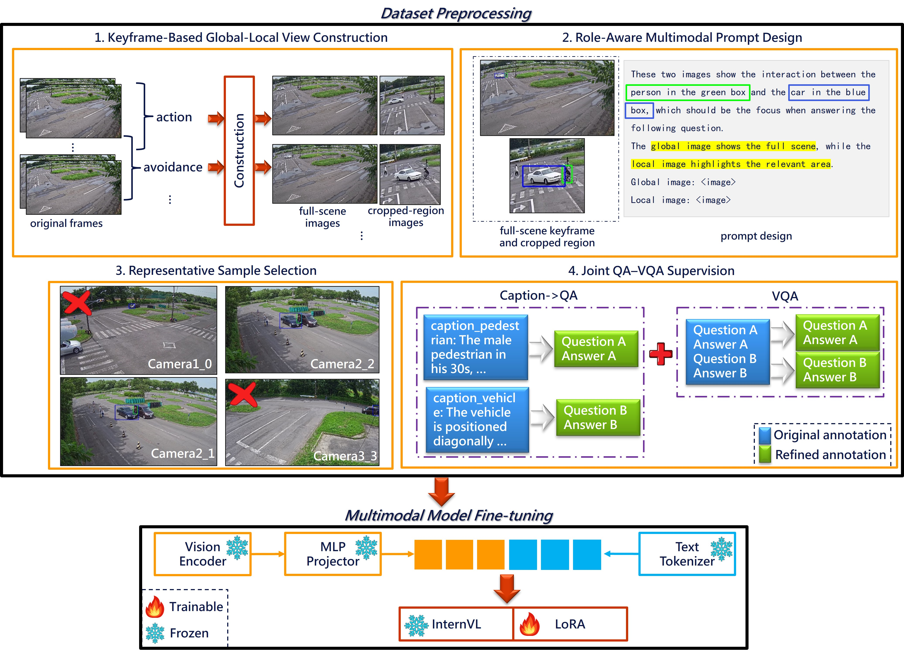

# 2025AICITY_Track2_TrafficInternVL

🥇  **1st Place** Solution to the 9th AI City Challenge (ICCV 2025 Workshop), Track 2: Traffic Safety Description and Analysis

📄 Paper: [TrafficInternVL: Understanding Traffic Scenarios with Vision–Language Models]()



## Leaderboard

| Rank | Team ID | Team Name                     | Score    |
|------|---------|-------------------------------|----------|
| 1    | 145     | **CHTTLIOT (ours)**           | **60.0393** |
| 2    | 1       | SCU_Anastasiu                 | 59.1184  |
| 3    | 52      | Metropolis_Video_Intelligence | 58.8483  |
| 4    | 137     | ARV                           | 57.9138  |
| 5    | 121     | Rutgers ECE MM                | 57.4658  |
| 6    | 68      | VNPT_AI                       | 57.1133  |
| 7    | 60      | AIO_GENAI4E                   | 55.6550  |
| 8    | 56      | GenAI4E_BunBo                 | 52.4267  |
| 9    | 86      | Tyche                         | 52.1481  |
| 10   | 49      | MIZSU                         | 45.7572  |
| 11   | 67      | Smart Lab                     | 45.5839  |
| 12   | 195     | Richardstars                  | 45.5559  |
| 13   | 89      | ISU_Reactors                  | 33.9381  |

## Environment

```Shell
conda create -n trafficinternvl python=3.10 -y
conda activate trafficinternvl
cd 2025AICITY_Track2_TrafficInternVL
pip install -r requirements.txt
pip install flash-attn --no-build-isolation
git clone https://github.com/OpenGVLab/InternVL
```

## Data Preparation Guide
This guide outlines the steps to prepare your dataset for model training and inference.  
It follows the approach from last year’s winning solution, [CityLLaVA](https://github.com/alibaba/AICITY2024_Track2_AliOpenTrek_CityLLaVA), with modifications tailored to this year’s dataset and task structure.

---

### Set Up Data Directory & Download Datasets

Navigate to the data_preprocess directory and create a data subdirectory to store all raw datasets:

```bash
cd data_preprocess
mkdir ./data
```

Download the required datasets from the [WTS dataset](https://github.com/woven-visionai/wts-dataset) repository. After downloading and unzipping, organize the files according to the structure below and place them into the data directory:

```
.
├── data
│   ├── BDD_PC_5k
│   │   ├── annotations
│   │   │   ├── bbox_annotated
│   │   │   ├── bbox_generated
│   │   │   ├── caption
│   │   │   └── vqa
│   │   └── videos
│   ├── WTS
│   │   ├── annotations
│   │   │   ├── 3D_gaze
│   │   │   ├── bbox_annotated
│   │   │   ├── bbox_generated
│   │   │   ├── caption
│   │   │   ├── head
│   │   │   └── vqa
│   │   └── videos
│   └── test_part
│       ├── view_used_as_main_reference_for_multiview_scenario.csv
│       ├── WTS_DATASET_PUBLIC_TEST
│       ├── WTS_DATASET_PUBLIC_TEST_BBOX
│       ├── SubTask1-Caption
│       │   ├── WTS_DATASET_PUBLIC_TEST
│       │   └── WTS_DATASET_PUBLIC_TEST_BBOX
│       └── SubTask2-VQA
```

### Process Data
Before running the preprocessing scripts:

- Move the `camera_parameters` folder from the WTS dataset to the root of the repository (i.e., `2025AICITY_Track2_TrafficInternVL/camera_parameters`).

- Open `prepare_data_train.sh` and update the `base_image_path` variable to the **absolute path** of your dataset directory.

```bash
bash prepare_data_train.sh
bash prepare_data_test.sh
```

After processing, the following annotation files will be generated:

- QA annotations: `data_preprocess/processed_anno/qa_format/wts_bdd_multimodal_qa_train_filtered.jsonl`

- VQA annotations: `data_preprocess/processed_anno/vqa_format/wts_bdd_multimodal_vqa_train_filtered.jsonl`

Test data will also be ready for direct inference with a fine-tuned model.

## Finetune InternVL with LoRA

⚠️ **Note**: All paths shown below are examples. Please adjust them according to your local environment.

Navigate to the model directory and clone the model repository:

```bash
cd model
git clone https://huggingface.co/OpenGVLab/InternVL2_5-38B-MPO
rm -rf InternVL2_5-38B-MPO/run
```

Create the dataset path configuration by adding a new file at:
`InternVL/internvl_chat/shell/data/aicity_finetune.json`

This file is used to combine both QA(Caption) and VQA datasets for joint finetuning. Ensure all paths correctly point to your processed data locations and that both sections are properly configured.

The structure of the file should look like this:

```json
{
  "qa": {
    "root": "",
    "annotation": "./data_preprocess/processed_anno/qa_format/wts_bdd_multimodal_qa_train_filtered.jsonl",
    "data_augment": false,
    "repeat_time": 1,
    "length": 21862
  },
  "vqa": {
    "root": "",
    "annotation": "./data_preprocess/processed_anno/vqa_format/wts_bdd_multimodal_vqa_train_filtered.jsonl",
    "data_augment": false,
    "repeat_time": 1,
    "length": 78422
  }
}
```

⚠️ **Note**:
1. Update the paths (annotation) to match your local environment.

2. Adjust the length fields to reflect the actual number of entries in your .jsonl files.

Next, initiate the finetuning process by running:

```bash
bash finetune_lora.sh
```

⚠️ **Common Issues & Fixes**:
1. `GLIBCXX_3.4.32` Not Found

    If you encounter the following error:
    
    ```
    ImportError: ...libstdc++.so.6: version `GLIBCXX_3.4.32' not found
    ```
    
    Update the `libstdc++` runtime by installing a newer version from conda-forge:
    
    ```bash
    conda install -n trafficinternvl libstdcxx-ng>=12 -c conda-forge -y
    ```

2. `bitsandbytes` CUDA Errors

    If you encounter errors related to bitsandbytes during finetuning (e.g., missing CUDA libraries), manually reinstall it by compiling from source:
    ```bash
    pip uninstall bitsandbytes
    git clone https://github.com/TimDettmers/bitsandbytes.git
    cd bitsandbytes
    CUDA_VERSION=128 python setup.py install 
    # Make sure nvcc is available and your CUDA environment is correctly set.
    ```

After training, the LoRA model will be saved.
Merge the LoRA weights into the base model and include all required files for inference.

## Inference

To evaluate model predictions on the `test set` for SubTask1 (Caption) and SubTask2 (VQA), follow the steps below.

Navigate to the inference directory and run the provided script:

```bash
cd inference
bash run_all.sh
```
This will produce two result files:

- `inference_qa_result.json`: Inference results for SubTask1 (Caption)  
- `inference_vqa_result.json`: Inference results for SubTask2 (VQA)

These two result files are used for submission to the [evaluation system](https://eval.aicitychallenge.org/aicity2025/login).

## License

This project is licensed under the GNU General Public License v3.0 (GPL-3.0).  
See the [LICENSE](LICENSE) file for details.

## Citation

```
@inproceedings{wu2025trafficinternvl,
  author    = {Hsiu-Fu Wu and Ya-Ting Yang and Yung-Ter Chen and I-Fan Chou},
  title     = {TrafficInternVL: Understanding Traffic Scenarios with Vision-Language Models},
  booktitle = {The International Conference on Computer Vision (ICCV) Workshops},
  year      = {2025}
}
```

## Acknowledgement

- TrafficInternVL is developed based on the implementations of [CityLLaVA](https://github.com/OpenDriveLab/CityLLaVA) and [InternVL](https://github.com/OpenGVLab/InternVL).
We sincerely acknowledge their contributions.